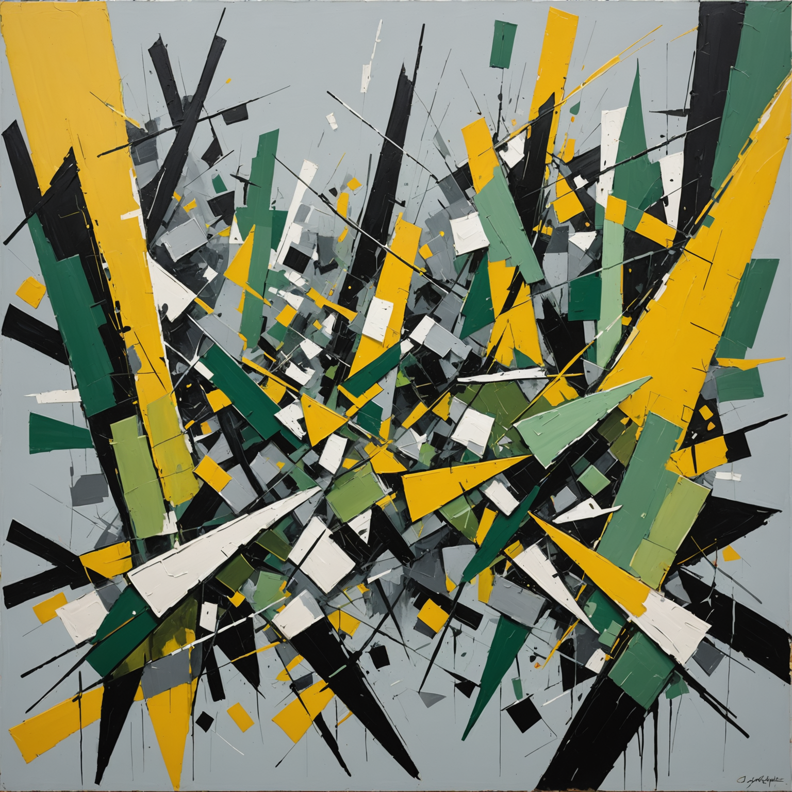
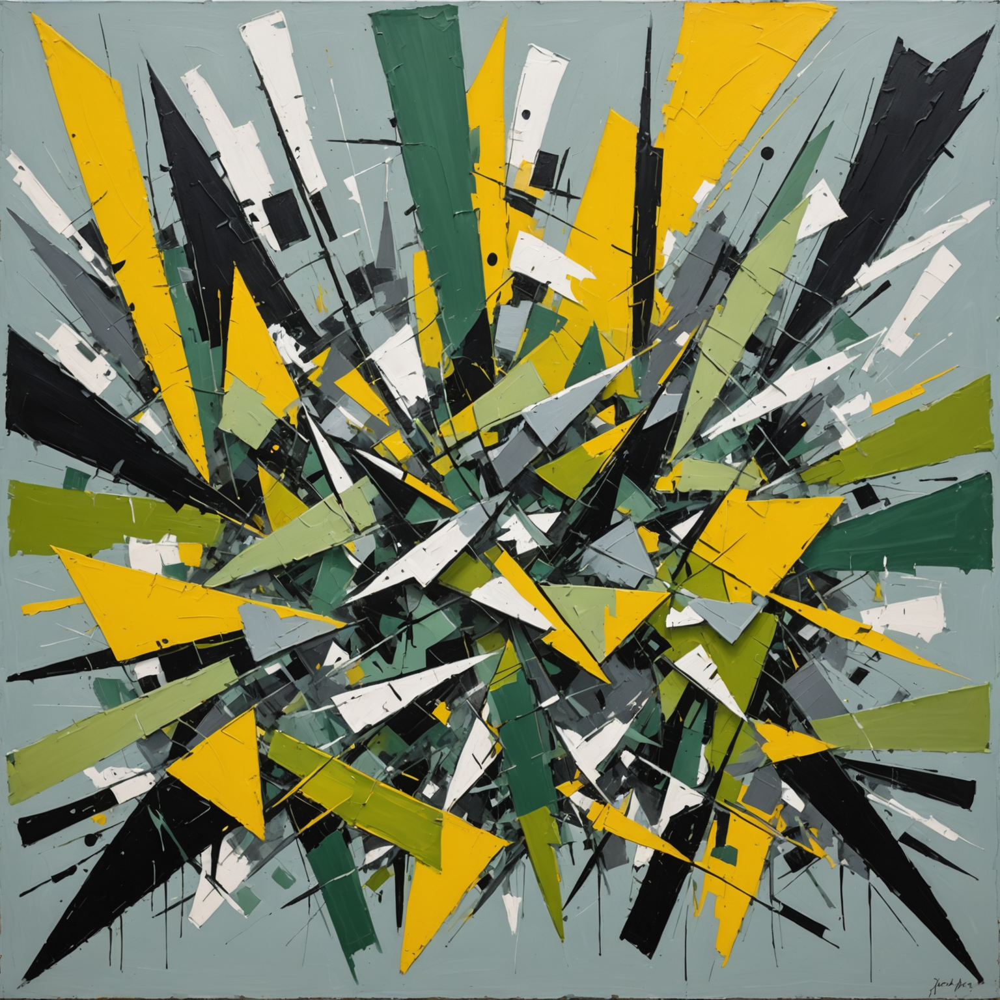
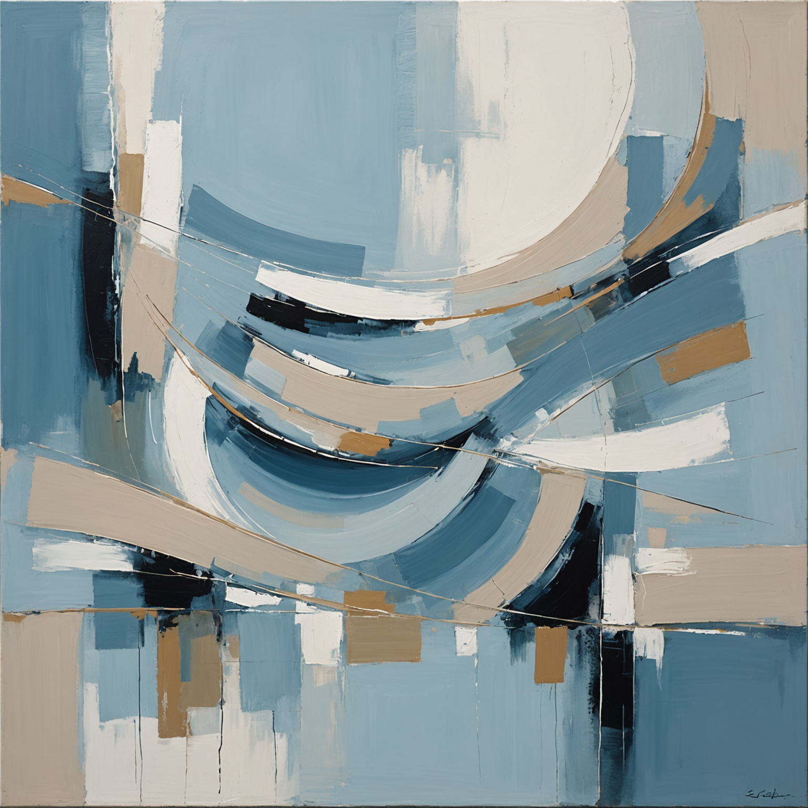
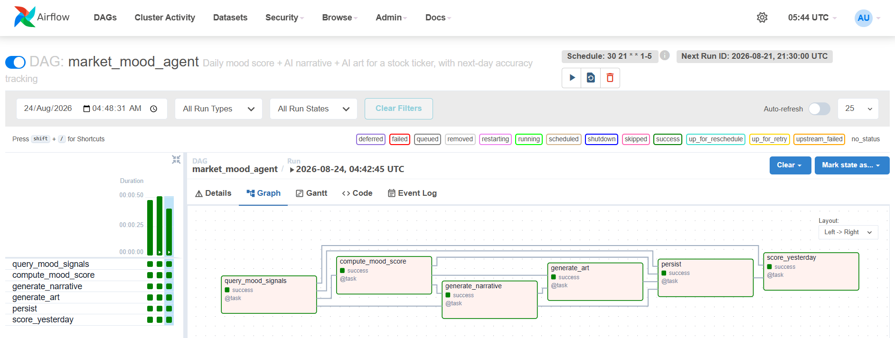
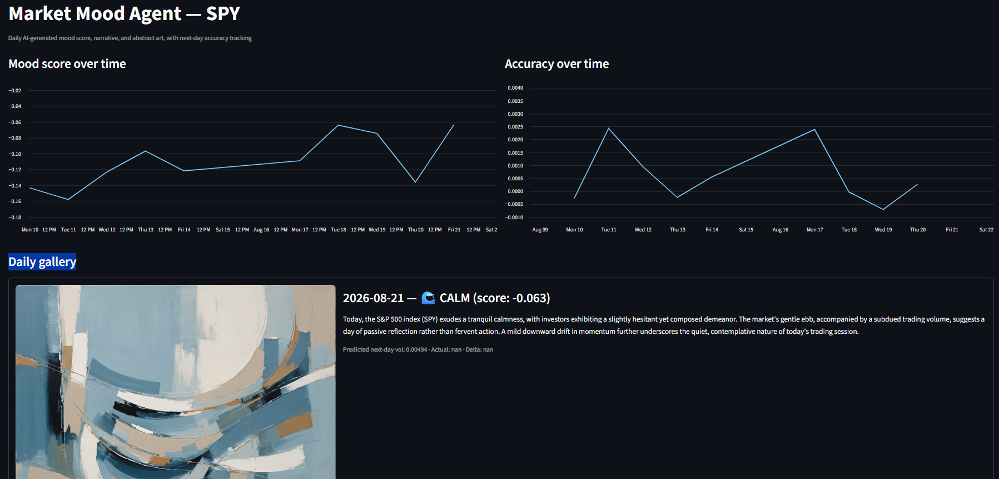
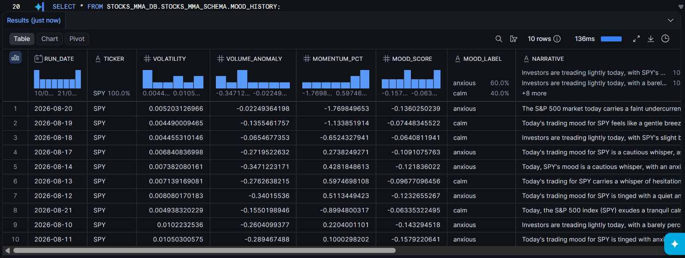
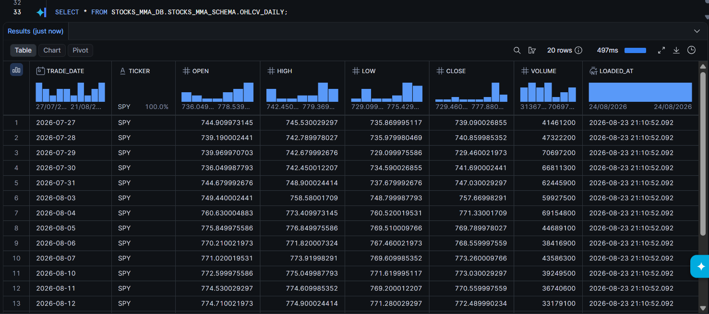
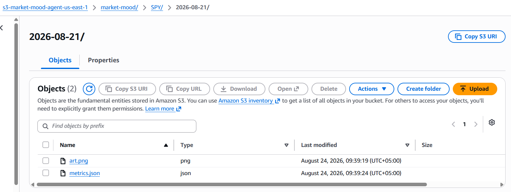
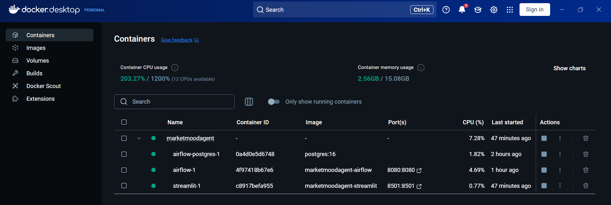

# Market Mood Agent

A self-running creative agent that reads real market data, computes a daily "mood," generates an abstract art piece + narrative via AWS Bedrock, and tracks its own prediction accuracy over time.

Built for the AWS Weekend Challenge. Every number, narrative, and painting below is real output from this pipeline; nothing here is a mockup.

<p align="center">
  
  
  
</p>
<p align="center"><em>SPY, three trading days, three moods, generated by Amazon Bedrock from that day's real volatility, momentum, and volume data.</em></p>

## How it works

```
Yahoo Finance (yfinance)
        │
OHLCV_DAILY (Snowflake)
        │
Airflow DAG: market_mood_agent
        │
        ├─ 1. query_mood_signals    → volatility, volume anomaly, momentum
        ├─ 2. compute_mood_score    → weighted score (-1 to +1) + label
        ├─ 3. generate_narrative    → Bedrock Nova Lite, 2-3 sentence mood text
        ├─ 4. generate_art          → Bedrock Stability, abstract image from narrative
        ├─ 5. persist               → image + metrics → S3, row → MOOD_HISTORY
        └─ 6. score_yesterday       → compares yesterday's predicted vol to today's
                                       realized vol, logs the accuracy delta
```

Each day, the agent predicts tomorrow's volatility. The next day, it checks itself against what actually happened and records the error as `accuracy_delta` in `MOOD_HISTORY`. That closed feedback loop is the whole point: the art and narrative are the presentation layer, but the agent is quietly grading its own forecasts every day.

## Screenshots

| | |
|---|---|
| **Airflow DAG: all 6 tasks green** | **Streamlit gallery: mood + accuracy charts** |
|  |  |
| **Real rows in Snowflake `MOOD_HISTORY`** | **Real OHLCV data in `OHLCV_DAILY`** |
|  |  |
| **Generated art + metrics landing in S3** | **The whole stack running in Docker** |
|  |  |

## Tech stack

| Layer | Tool |
|---|---|
| Orchestration | Apache Airflow (Dockerized, TaskFlow API) |
| Market data | `yfinance` → Snowflake `OHLCV_DAILY` |
| Mood scoring | pandas/numpy, weighted rule-based score |
| Narrative | AWS Bedrock (Amazon Nova Lite) |
| Art | AWS Bedrock (Stability AI `stable-image-core`) |
| Storage | Amazon S3 (images + metrics JSON), Snowflake (`MOOD_HISTORY`) |
| Proof surface | Streamlit |

## Step-by-step: recreating this from scratch

### Prerequisites
- Docker Desktop
- An AWS account with `aws configure` already run locally (credentials get mounted read-only into the containers; nothing is copied into `.env`)
- A Snowflake account with a warehouse you can use
- [`gh`](https://cli.github.com/) or `git` if you're cloning rather than downloading

### 1. Check Bedrock model access in your account/region

This is the step most likely to trip you up, so do it first. Confirm you have an active (not `LEGACY`) text model and an active text-to-image model:

```bash
aws bedrock list-foundation-models --region us-east-1 \
  --query "modelSummaries[?contains(modelId,'nova-lite')].{ID:modelId,Status:modelLifecycle.status}"

aws bedrock list-foundation-models --region us-west-2 \
  --query "modelSummaries[?contains(modelId,'stable-image-core')].{ID:modelId,Status:modelLifecycle.status}"
```

Both should show `ACTIVE`. If not, you'll need to find whichever regions/models *are* active in your account; model availability shifts over time and by account, which is exactly what happened during this build (see `checklist.md`). Update `BEDROCK_TEXT_MODEL_ID`, `BEDROCK_IMAGE_MODEL_ID`, `AWS_REGION`, and `BEDROCK_IMAGE_REGION` in `.env` accordingly if yours differ.

### 2. Create the S3 bucket

```bash
aws s3 mb s3://<your-bucket-name> --region us-east-1
```

### 3. Set up Snowflake

Run these against your account (Snowsight worksheet, or `snowsql`):

```sql
CREATE DATABASE STOCKS_MMA_DB;
CREATE SCHEMA STOCKS_MMA_SCHEMA;
```

Then run `sql/ohlcv_daily.sql` and `sql/mood_history.sql` to create the two tables.

### 4. Configure environment

```bash
cp .env.example .env
```

Fill in: `S3_BUCKET` (from step 2), and the `SNOWFLAKE_*` credentials (account identifier, user, password, warehouse, role) for the database/schema from step 3.

### 5. Build and start everything

```bash
docker compose up -d --build
```

This starts three services: `airflow-postgres` (Airflow's own metadata DB, unrelated to your Snowflake data), `airflow` (standalone webserver + scheduler + triggerer), and `streamlit` (the gallery). First build takes a few minutes.

- Airflow UI: `http://localhost:8080`, username `admin`. Get the generated password with:
  ```bash
  docker compose exec airflow cat /opt/airflow/standalone_admin_password.txt
  ```
  (On Windows Git Bash, prefix with `MSYS_NO_PATHCONV=1` or the path gets mangled.)
- Streamlit gallery: `http://localhost:8501`

### 6. Load real market data

```bash
docker compose exec airflow python /opt/airflow/scripts/load_ohlcv.py
```

Pulls ~20 trading days of real OHLCV for whatever ticker is in `TARGET_TICKERS` (default `SPY`) from Yahoo Finance into `OHLCV_DAILY`.

### 7. Backfill history

```bash
docker compose exec airflow python /opt/airflow/scripts/backfill.py
```

Populates `MOOD_HISTORY` for the last 10 trading days (with art generated for 3 representative days, to keep this step fast and cheap); this is what gives the Streamlit accuracy chart something to plot on first run, instead of a single point.

### 8. Unpause and trigger the live DAG

New DAGs are paused by default (this step is easy to miss, see `checklist.md`):

```bash
docker compose exec airflow airflow dags unpause market_mood_agent
docker compose exec airflow airflow dags trigger market_mood_agent
```

Watch it run in the Airflow UI (`Graph` tab), or check status from the CLI:

```bash
docker compose exec airflow airflow dags list-runs -d market_mood_agent
```

### 9. View the result

Open `http://localhost:8501`; you should see the mood/accuracy charts and a daily gallery with real narratives and art.

From here, the DAG's own schedule (`30 21 * * 1-5` UTC, ~4:30 PM ET) takes over and adds one new day at a time, each one automatically scored against the previous day's prediction.

## Project structure

```
market-mood-agent/
├── dags/
│   └── market_mood_agent.py   # the 6-task DAG
├── mood/
│   ├── signals.py             # pulls + computes volatility/momentum/volume signals
│   ├── score.py                # weighted score → mood label
│   ├── narrative.py            # Bedrock Nova Lite call
│   ├── art.py                  # Bedrock Stability call
│   └── persist.py              # shared S3 + Snowflake write path
├── scripts/
│   ├── load_ohlcv.py           # one-off: pull real OHLCV from yfinance
│   ├── backfill.py             # populate MOOD_HISTORY for past trading days
│   ├── test_mood.py            # standalone signals+score test
│   └── test_bedrock.py         # standalone narrative+art test
├── sql/
│   ├── ohlcv_daily.sql
│   └── mood_history.sql
├── streamlit_app.py            # gallery + accuracy chart
├── Dockerfile
├── docker-compose.yml
└── checklist.md                 # full build log: every phase, every "what broke", in order
```

## What broke (the honest version)

Two of the AWS assumptions this project started with turned out to be wrong mid-build: the "existing pipeline" database didn't actually exist in this Snowflake account, and Amazon Nova Canvas (the image model the whole art step was designed around) turned out to be deprecated and access-locked. Both are documented in detail, with the actual error messages and fixes, in [`checklist.md`](checklist.md).
